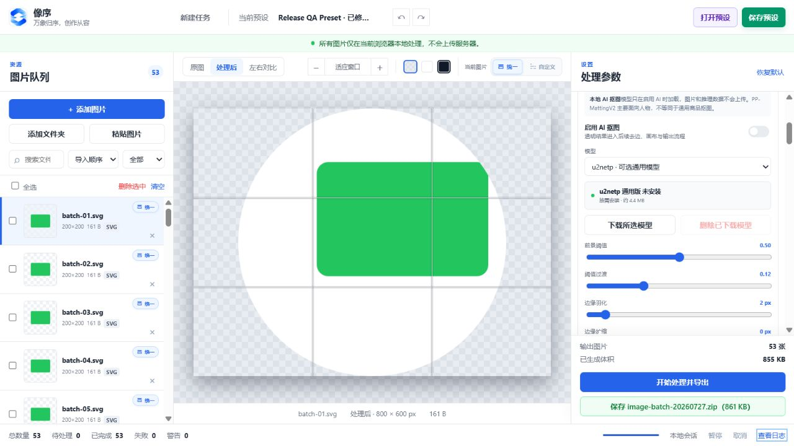
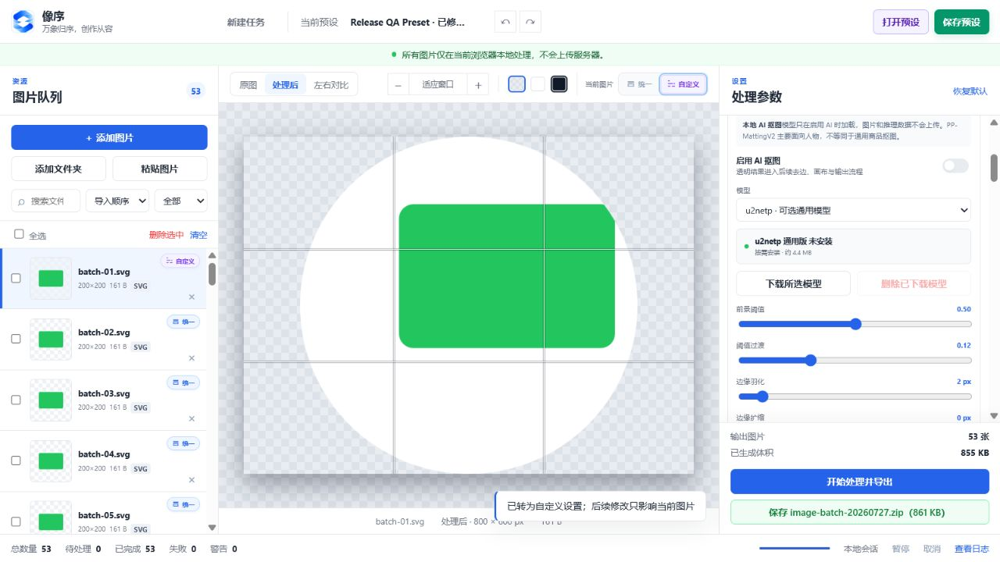

<div align="center">
  
  <h1>像序 Xiangxu</h1>
  <p><strong>万象归序，创作从容。</strong></p>
  <p>本地优先、面向设计师与内容创作者的图片批处理工作台。</p>
  <p>
    <a href="https://xiangxu.vercel.app">在线体验</a>
    ·
    <a href="docs/model-guide.md">AI 模型指南</a>
    ·
    <a href="docs/deployment.md">部署说明</a>
    ·
    <a href="CHANGELOG.md">更新记录</a>
  </p>
</div>

---

## 像序能做什么

像序把图片导入、逐图调整、批量处理、质量检查和导出整理在一个三栏工作台中。图片处理默认在当前设备完成，不上传原图，也不会修改源文件。

| 能力 | 主要特点 |
| --- | --- |
| 批量工作台 | 文件、文件夹、拖放和剪贴板导入；队列搜索、排序、筛选、批量删除 |
| 统一与逐图设置 | 全局统一参数与单图自定义参数并存，实时预览与正式导出使用同一套处理逻辑 |
| 本地 AI 抠图 | 内置 PP-MattingV2 人像模型和 u2netp 通用模型，支持羽化、边缘扩缩和增减区域画笔 |
| 颜色处理 | 基础调色、RGB 曲线、近似颜色替换、选色转透明、灰度和反相，支持直接从画布吸色 |
| 尺寸与构图 | 内容尺寸、主体占比、裁切、形状蒙版、最终画布、九宫格定位、边距与偏移 |
| 水印与压缩 | 文字/图片水印、JPG/WebP 质量、目标体积与可选降分辨率 |
| 批量导出 | PNG、JPG、WebP；安全 ZIP、已授权文件夹写入、命名模板与防重名 |
| 素材与检查 | Sprite Sheet、JSON/CSS/Markdown 清单、重复/相似图片检查与问题报告 |
| 预设系统 | 系统预设、用户预设、搜索、收藏、重命名、JSON 导入导出 |

## 核心体验

### 一套流水线，预览与导出一致

处理顺序固定且可见：

```text
AI 抠图 → 自动去边 → 裁切 → 内容尺寸 → 形状蒙版
       → 最终画布 → 边距与位置 → 颜色 / 水印 → 输出
```

流水线节点会显示“已开启 / 已关闭”，点击节点可直接定位对应设置。关闭的模块不会偷偷参与处理。

### 统一设置与单图自定义

- 新导入一组图片后，第一张会自动选中并显示在预览区。
- 图片默认使用统一设置，可随时切换为独立的自定义设置。
- 左侧队列通过蓝色、紫色标签与图标区分两种模式，并支持按模式筛选。
- 自定义参数会真实参与预览、文件检查、Sprite Sheet 和批量导出。
- 用户预设只保存统一参数，不会意外覆盖已有单图自定义设置。

### 更直接的颜色处理

颜色功能使用标签页切换，不依赖难以理解的下拉菜单：

- **基础调整**：曝光、亮度、对比度、饱和度、色温、色调、色相、透明度和 RGB 曲线。
- **颜色替换**：设置来源色、目标色与容差；来源色和目标色都可从图片吸取。
- **转透明**：选取任意颜色并按容差转为透明，只显示该模式需要的参数。
- **灰度 / 反相**：直接应用效果，不显示无关的颜色输入或基础调色参数。

画布吸色会自动切换到原图以避免采到已经处理过的颜色，按 `Esc` 可取消。

### 本地 AI 抠图与手工修边

像序的基础图片处理不依赖 AI。只有开启“AI 一键抠图”时才会加载推理引擎和所选模型。

| 模型 | 定位 | 体积 | 适用场景 | 状态 |
| --- | --- | ---: | --- | --- |
| PP-MattingV2 STDC1 Human 512 | 人像抠图 | 约 34.3 MB | 人物、头发和人像边缘 | 内置 ONNX |
| u2netp | 轻量通用抠图 | 约 4.4 MB | 商品、图标和一般主体 | 内置 ONNX |

抠图结果支持：

- 边缘羽化；
- 负值向内收缩、正值向外扩展；
- “增加区域 / 减少区域”画笔；
- 一键还原自动 Mask；
- 当前图片笔触的撤销、重做和清除；
- Mask 与推理会话缓存，减少重复计算。

内置模型通过 ONNX Runtime Web 的 CPU/WASM 后端运行。EXE 和本地源码版可直接读取本地模型；在线版首次使用 AI 时会从像序站点按需加载模型文件，但图片数据仍留在本机。

“更多开源模型”只展示许可证、适用场景、运行环境、兼容状态和第三方链接，不会把外部权重写入像序缓存。PaddleSeg 是一个分割工具箱，不是单一抠图模型；其 PP-MattingV2 官方推理包也不能直接导入像序网页版，通常需要转换为符合像序输入输出约定的 ONNX 模型。详见[模型指南](docs/model-guide.md)。

### 安全、可追踪的导出

- 默认使用安全 ZIP：先完成全部处理，再由用户点击绿色按钮保存。
- 支持 File System Access API 的 Chrome/Edge 可写入用户明确授权的文件夹。
- 无可复用目录权限时自动回退 ZIP，不会写入未知位置。
- 单张失败不会中断整个批次；进度、成功、失败和警告都有日志。
- 文件名模板支持 `{原文件名}`、`{序号}`、`{宽度}`、`{高度}`、`{格式}`、`{日期}` 和 `{时间}`。

## 快速开始

### 在线使用

打开 [xiangxu.vercel.app](https://xiangxu.vercel.app)。

推荐使用最新版 Chrome 或 Edge。在线版无需安装，图片仍在浏览器本地处理。

### Windows 本地源码版

1. 下载或克隆项目。
2. 双击根目录中的 `start.bat`。
3. 浏览器会打开 `http://localhost:5173`。
4. 关闭启动窗口即可停止本地服务。

运行应用不需要 `npm install`。启动器优先使用 Python 3，没有 Python 时会回退到 Windows PowerShell。

### Windows EXE

双击打包后的 `像序.exe` 即可运行，无需安装 Python 或 Node.js。桌面版依赖 Microsoft WebView2 Runtime，Windows 10/11 通常已随 Edge 安装。

当前 EXE 没有商业代码签名证书，从网络下载后 Windows SmartScreen 可能显示“未知发布者”。这不等同于病毒检测结果，用户仍应从项目官方仓库或可信发布渠道获取文件并核对哈希。

### macOS

项目提供 macOS 本地启动包的构建与验证脚本，说明见 [packaging/macos/README-MACOS.md](packaging/macos/README-MACOS.md)。Windows 环境无法生成经过 macOS 签名、公证的原生应用包，正式分发仍需在 macOS 上构建和验证。

## 常用操作

1. 添加图片、文件夹，或直接拖入/粘贴图片。
2. 在左侧选择图片；需要独立参数时切换为“自定义设置”。
3. 在右侧按流水线顺序开启模块并调整参数。
4. 使用“原图 / 处理后 / 左右对比”核对结果。
5. 在“输出与压缩”中选择格式和导出方式。
6. 点击“开始处理并导出”，处理完成后确认保存。

## 隐私与联网边界

- 原始图片、处理结果、笔触和预设默认保存在当前设备，不上传图片服务器。
- 浏览器版的预设保存在 IndexedDB，不可用时回退 localStorage。
- 本地 AI 推理由 ONNX Runtime Web 在设备端执行。
- 在线版首次使用内置 AI 模型时，会从同源站点读取模型文件；请求不包含用户图片。
- 只有用户主动打开外部模型资料或下载链接时才会进入第三方网站。
- 外部链接会在新窗口打开，并在界面中明确标记第三方来源。

## 支持的格式

| 场景 | 格式 |
| --- | --- |
| 导入 | PNG、JPG/JPEG、WebP、BMP、SVG、GIF 第一帧 |
| 导出 | PNG、JPG、WebP |
| 图片水印 | PNG、JPG/JPEG、WebP、SVG |
| 预设 | JSON |
| Sprite Sheet | PNG + JSON + CSS + Markdown |

## 开发与测试

应用主体使用原生 HTML、CSS 和 JavaScript ES Modules，没有前端构建步骤，也不依赖在线 CDN、远程字体或远程图标。

```text
index.html              应用入口与三栏工作台
css/                    设计令牌、布局与组件样式
js/state/               状态、动作、撤销与重做
js/import/              文件、文件夹、拖放与剪贴板导入
js/render/              预览和正式导出的像素流水线
js/ai/                  模型管理、ONNX 推理与 Mask 调整
js/export/              编码、ZIP、目录写入和导出任务
js/presets/             系统与用户预设
js/inspection/          图片检查、重复与相似检测
models/                 模型清单与外部模型配置
assets/models/          内置 ONNX 模型
vendor/                 ONNX Runtime Web 本地运行时
packaging/              Windows 与 macOS 封装脚本
tests/                  Node.js 回归测试
```

运行全部回归测试：

```powershell
node --test tests/*.test.mjs
```

当前测试覆盖内置模型完整性、颜色引擎、单图自定义设置、AI 笔触几何、边缘调整、导出安全、外部模型目录和本地 MIME 映射。

## 已知限制

- AI 推理目前固定使用 CPU/WASM；较大的图片或低性能设备首次抠图可能需要等待。
- PP-MattingV2 内置版本是人像模型，不适合所有商品、动物或任意物体。
- 预览最长边会降采样到 2048 px 控制内存，正式导出仍按目标分辨率重新渲染。
- GIF 只读取第一帧；动态 WebP 暂不进行完整动画帧处理。
- 自由裁切目前通过宽高百分比设置，尚无可拖动裁切边框手柄。
- 暂停或取消会在当前单张编码结束后生效，无法中断浏览器正在执行的单次 `canvas.toBlob()`。
- 基础相似检测使用 16×16 平均哈希，对旋转、裁切或大幅调色后的图片识别有限。
- PNG 没有浏览器原生质量参数；目标 KB 模式只能在允许时通过降低分辨率继续逼近。
- 未实现的增强项包括流水线拖动排序、四角独立圆角、渐变/模糊延展背景和批次总体积限制。

## 更多文档

- [AI 模型与兼容指南](docs/model-guide.md)
- [隐私说明](docs/privacy.md)
- [Vercel 部署说明](docs/deployment.md)
- [第三方依赖与许可证](THIRD_PARTY_NOTICES.md)
- [版本更新记录](CHANGELOG.md)

## 界面预览





## License

**许可证状态：待确定。**

项目目前暂未添加开源许可证。在项目所有者正式选择许可证之前，源代码公开可见不代表已授予复制、修改或再分发权利。第三方代码与模型分别遵循其自身许可证，详见 [THIRD_PARTY_NOTICES.md](THIRD_PARTY_NOTICES.md)。
